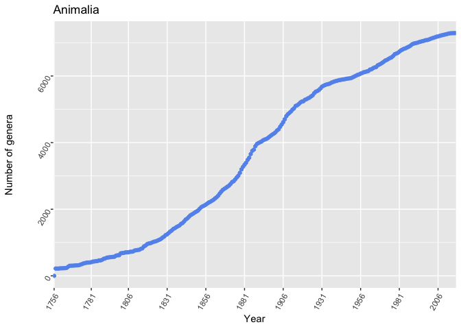
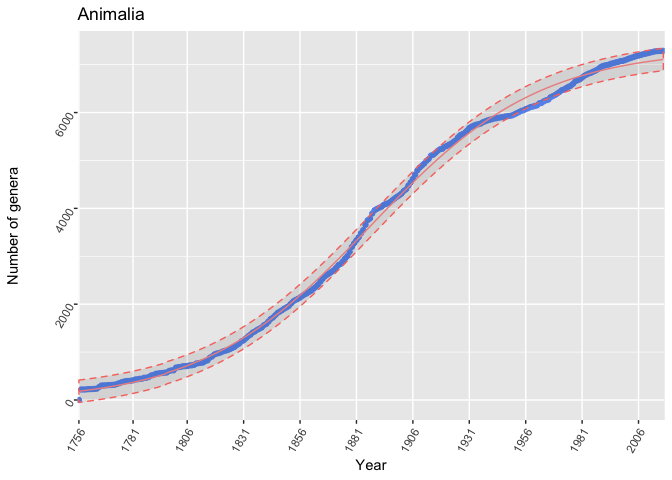

RTools for Antarctica and the Southern Ocean Biodiversity
================
Hsun-Yi Hsieh

Occurrence data retrieval
-------------------------

[The Global Biodiversity Information Facility (GBIF)](https://www.gbif.org/), [the Ocean Biogeographic Information System (OBIS)](http://www.iobis.org/) and <a href = "http://biodiversity.aq">ANTABIF</a> all provide species occurrence data. As the GBIF harbors occurrences of both terrestrial and marine species at the globa scale, the OBIS is the most comprehensive source of marine species occurrences and ANTABIF aims to establish as an authority of biodiversity data for Antarctica and the Southern Ocean.

The construction of the ANTABIF API is an ongoing project. This page presents the retrieval, analysis and visualization of GBIF and OBIS occurrence data. The following sections will provide a basic workflow for data cleaning, wrangling, analysis and visualisation in R.

**GBIF**</br>

<a href = "https://ropensci.org/tutorials/rgbif_tutorial/">rgbif</a> helps users retrieve data from the GBIF.

Some basic commends are:

    occ_search()
    occ_download()
    occ_download_get()
    occ_get()

Basic uses of these commands:

``` r
#search by scientificName.
occ_search(scientificName = 'Ursus americanus', limit = 20, return = "meta")

#search by dataset key.
occ_search(datasetKey='7b5d6a48-f762-11e1-a439-00145eb45e9a', return='data', limit=20)

#search on latitidue and longitude
occ_search(search="kingfisher", decimalLatitude=50, decimalLongitude=-10)

#get data for specific GBIF occurrences.
occ_get(key=855998194, return='data')
```

Alternatively, users can download data directly from GBIF. For instance, [Antarctic Plant Database](%22https://www.gbif.org/dataset/82d9ff5c-f762-11e1-a439-00145eb45e9a%22) harbors more than 50,000 occurrences of over 40,000 plant specimens from Antarctica, the sub-Antarctic islands and surrounding continents.

Or, download and import the data by takig one step as follows.

    dd_gbif <- occ_download_get(key = "0000066-140928181241064", overwrite = TRUE) %>% 
        occ_download_import(dd_gbif_download, na.strings = c("", NA))

**OBIS**</br> <a href = "https://github.com/iobis/robis">robis</a> helps users retrieve data from the OBIS.

``` r
occurrence("Actinauge verrillii")
```

``` r
#restrict fields in result set
data <- occurrence("Actinauge verrillii", fields = c("decimalLongitude", "decimalLatitude"))

#Get occurrences by geometry
data <- occurrence("Actinauge verrillii", geometry = "POLYGON ((54.60 51.16772, 2.62436 51.14059, 2.76066 51.19225, 2.73216 51.20946, 54.60 51.16772))")
```

Data browsing, cleaning and wrangling
-------------------------------------

**- tidyverse -**</br> The <a href = "https://www.tidyverse.org/packages/"> **tidyverse**</a> is a collection of R packages designed for data science. The collection includes <a href = "http://dplyr.tidyverse.org/">**dplyr**</a> for data frame creation and manipulation, <a href = "http://readr.tidyverse.org/">**readr**</a> and <a href = "http://readxl.tidyverse.org/">**readxl**</a> for reading data from text or EXCEL files, <a href = "http://purrr.tidyverse.org/">**purrr**</a> for speeding up functional prorgramminga and <a href = "http://ggplot2.tidyverse.org/">**ggplot2**</a> for visualization.

Users can install all the packages in the tidyverse by running

    install.packages("tidyverse")

Alternatively, install one or more single package(s) by running, for instance,

    install.packages("tidyr")
    install.packages("dplyr")

Or download the development versions from GitHub

    devtools::install_github("tidyverse/tidyr")
    devtools::install_github("tidyverse/dplyr")

basic commands:

``` r
filer() 
mutate() 
select() 
arrange() 
group_by() 
```

basic uses of these commands:

``` r
library(robis)
library(dplyr)

data <- occurrence("Actinauge verrillii")

#picks cases based on selected values
data %>% 
  filter(decimalLongitude < -60)

#picks variables based on their names and leave out unwanted values
data %>%
  filter(decimalLongitude < -60) %>%
  select(decimalLongitude, decimalLatitude)
```

**- rrefine -**</br> OpenRefine is an open source data cleaning software. <a href = "http://openrefine.org/">rrefine</a> is a R package that allows users to programmatically triger data transfer between R and *OpenRefine*.

``` r
library(rrefine)
```

`refine_upload()` uploades data to *OpeRefine* from R</br> `refine_export()` exports data to R from *OpenRefine*</br> `refine_delete()` deletes *OpenRefine* project</br>

**- obistools -**</br> obistools provides a set of functions for data enhancement and quality control. For instance,

`match_taxa()` performs interactive taxon matching with the World Register of Marine Species.

``` r
library(obistools)
names <- c("Actinostola crassicornis", "Actinostola", "Actinostola georgiana")
match_taxa(names)
```

`check_onland()` uses the xylookup web service which internally uses land polygons from *OpenStreetMap* to check if any points are located on land. Other shapefiles can be used as well.</br>

`check_fields()` checks if all OBIS required fields are present in an occurrence table and if any values are missing. This is especially useful for users who would like to contribute their data to the OBIS data portal.

More functions can be found on \[obistools\]&lt;"<https://github.com/iobis/obistools>"&gt;</br>

Taxonomy Tools
--------------

**- taxize -**</br> [taxize](https://ropensci.org/tutorials/taxize_tutorial/) is capable of collecting different taxonomic data sources online, including NCBI, ITIS, GBIF, EOL, IUCN and more. For instance,

`get_wormsid()` gets WORMS identifiers.

``` r
ids <- get_wormsid(c("Actinostola crassicornis", "Actinostola", 'Actinostola georgiana'))
```

**- biotaxa -**</br> [biotaxa](https://github.com/hhsieh/rtools2) is a tool for the exploration and visualization of taxa discovery.

To install the package,

``` r
devtools::install_github("hhsieh/biotaxa_Rpackage")
library(biotaxa)
```

A`biotaxa` dataset should contain at least two columns of taxa classifications - *kingdom*, *phylum*, *class*, *order*, *family*, *genus*, and *species* or *AphiaID*, as well as *year*, which denotes taxa discovery year. Take a look of the example dataset,

``` r
library(biotaxa)
head(data_m)
```

    ##   AphiaIDs  Kingdoms      Phyla           Classes       Orders
    ## 1   610727 Chromista Ochrophyta Bacillariophyceae Achnanthales
    ## 2   149387 Chromista Ochrophyta Bacillariophyceae Achnanthales
    ## 3   677605 Chromista Ochrophyta Bacillariophyceae Achnanthales
    ## 4   160618 Chromista Ochrophyta Bacillariophyceae Achnanthales
    ## 5   661772 Chromista Ochrophyta Bacillariophyceae Achnanthales
    ## 6   160622 Chromista Ochrophyta Bacillariophyceae Achnanthales
    ##        Families     Genera year
    ## 1 Achnanthaceae Achnanthes 1996
    ## 2 Achnanthaceae Achnanthes 1824
    ## 3 Achnanthaceae Achnanthes 1965
    ## 4 Achnanthaceae Achnanthes 1895
    ## 5 Achnanthaceae Achnanthes 1963
    ## 6 Achnanthaceae Achnanthes 1880

To visualize the accmulation curve of all genera belonging to Animalia, use `taxaaccum()`</br>

``` r
taxaaccum("Animalia", "Genus")
```



`frequencyrank()` lists and ranks all of the lower taxa of a higher taxa by frequency.</br>

``` r
fc <- frequencyrank("Salpidae", "Genus")
fc <- fc[fc$Genus != "", ]
fc
```

    ##    Genus freq
    ## 3  Ihlea    6
    ## 5  Salpa    6
    ## 6 Thalia    2
    ## 2  Iasis    1
    ## 4  Pegea    1

`OBIS_imprecisionrate()` finds out the proportion of taxa occurrences on OBIS unidentified to species levels. </br>

``` r
OBIS_imprecisionrate("Salpidae")
```

    ## 
    Retrieved 2000 records of 20844 (9%)
    Retrieved 4000 records of 20844 (19%)
    Retrieved 6000 records of 20844 (28%)
    Retrieved 8000 records of 20844 (38%)
    Retrieved 10000 records of 20844 (47%)
    Retrieved 12000 records of 20844 (57%)
    Retrieved 14000 records of 20844 (67%)
    Retrieved 16000 records of 20844 (76%)
    Retrieved 18000 records of 20844 (86%)
    Retrieved 20000 records of 20844 (95%)
    Retrieved 20844 records of 20844 (100%)

    ## [1] 0.7779217

`alltaxalist()` lists all taxa and their ranks (from Kingdom to Genus) in a dataset</br>

``` r
taxa_list <- alltaxalist(data_m)
no_rows <- nrow(taxa_list) 
no_rows
```

    ## [1] 11109

`taxamodel()` fits the taxonomic accumulation of a given taxa with user-selected logistic, Michaelis-Menten, or asymtopic regression model.</br>

``` r
taxamodel(taxa = "Animalia", rank = "Genus", method = "logistic")
```



More can be found on [biotaxa](https://github.com/hhsieh/biotaxa_Rpackage).</br>

Visualization
-------------

The [Github page of Australian Antarctic Data Center](https://github.com/AustralianAntarcticDataCentre/antanym-demo) hosts nice source code for polar stereographic projection.

To test the code, first install the leaflet package of the rstudio version.

    devtools::install_github("rstudio/leaflet")
    library(leaflet)
    library(dplyr)

    library(antanym)
    library(leaflet)
    g <- an_read()

    ## find single name per feature, preferring United Kingdom
    ##  names where available, and only rows with valid locations
    temp <- g %>% an_preferred("United Kingdom")
    temp <- fc <- na.omit(fc)temp[!is.na(temp$longitude) & !is.na(temp$latitude),]

    ## replace NAs with empty strings in narrative
    temp$narrative[is.na(temp$narrative)] <- ""

    ## formatted popup HTML
    popup <- sprintf("<h1>%s</h1><p><strong>Country of origin:</strong> %s<br />
      <strong>Longitude:</strong> %g<br /><strong>Latitude:</strong> %g<br />
      <a href=\"https://data.aad.gov.au/aadc/gaz/scar/display_name.cfm?gaz_id=%d\">
        Link to SCAR gazetteer</a></p>",temp$place_name,temp$country_name,
      temp$longitude,temp$latitude,temp$gaz_id)

    m <- leaflet() %>%
      addProviderTiles("Esri.WorldImagery") %>%
      addMarkers(lng = temp$longitude, lat = temp$latitude, group = "placenames",
        clusterOptions = markerClusterOptions(),popup = popup,
        label = temp$place_name)

    startZoom <- 1

    crsAntartica <-  leafletCRS(
      crsClass = 'L.Proj.CRS',
      code = 'EPSG:3031',
      proj4def = '+proj=stere +lat_0=-90 +lat_ts=-71 +lon_0=0 +k=1 +x_0=0 +y_0=0 +ellps=WGS84 +datum=WGS84 +units=m +no_defs',
      resolutions = c(8192, 4096, 2048, 1024, 512, 256),
      origin = c(-4194304, 4194304),
      bounds =  list( c(-4194304, -4194304), c(4194304, 4194304) )
    )

    mps <- leaflet(options = leafletOptions(crs = crsAntartica, minZoom = 0, worldCopyJump = FALSE)) %>%
        setView(0, -90, startZoom) %>%
        addCircleMarkers(lng = temp$longitude, lat = temp$latitude, group = "placenames",
                         popup = popup, label = temp$place_name,
                         fillOpacity = 0.5, radius = 8, stroke = FALSE, color = "#000",
                         labelOptions = labelOptions(textOnly = FALSE)) %>%
        addWMSTiles(baseUrl = "https://maps.environments.aq/mapcache/antarc/?",
                    layers = "antarc_ramp_bath_shade_mask",
                    options = WMSTileOptions(format = "image/png", transparent = TRUE),
                    attribution = "Background imagery courtesy <a href='http://www.environments.aq/'>environments.aq</a>") %>%
        addGraticule()
    mps

Workflow demonstration
----------------------

This section demonstrates a simple workflow of applying the basic RTools for data retrieval, cleaning, analysis and visulisation.

    install.packages(c("rgbif", "tidyverse", "sp", "raster"))
    library(rgbif)
    library(tidyverse)
    library(sp)
    library(mapr)
    library(raster)

Here we use [Antarctic Plant Database](%22https://www.gbif.org/dataset/82d9ff5c-f762-11e1-a439-00145eb45e9a%22) as an example. After downloading the entire dataset from the GBIF, we can start exploring it for a bit. We aim to understand how each species in this dataset distributes in the interested region (Antarctica and sub-Antarctica) and across the globe.</br>

    #set working directory to where the dataset is saved
    setwd("path") 

    #read in the dataset
    occurrence <- read.table("occurrence.txt", header = T, sep = "\t", fill = TRUE, quote = "")

    #get an overview of the dataset
    head(occurrence)

    #find the dimension of the dataset
    dim(occurrence) #Here it shows there are 52,181 occurrences

    #find how many unique taxon keys there are in the dataset. 
    length(unique(occurrence$taxonKey)) #there are 2,653 unique taxon keys

We will retrieve all of the occurrence data of the first 10 taxon keys by using the GBIF occ\_search() and compute their regional distributions in Antarctica (60-90**<sup>∘</sup>S), subantarctica (45-60**<sup>∘</sup>S), south temperate (30-45**<sup>∘</sup>S), tropics (30**<sup>∘</sup>N-30**<sup>∘</sup>S), north temperate (30-60**<sup>∘</sup>N) and the arctic (60-90**<sup>∘</sup>N).</br>

First, we write a function to retrieve all of the occurrence data of the 10 taxon keys via using occ\_search() and compute their regional distributions

    whereGet <- function(taxonKey) {
      dd <- occ_search(taxonKey, return = "data")
      lats <- na.omit(dd$decimalLatitude) #discard occurrences without latitudes
      Antarctic <- subset(lats, lats >= -90 & lats <= -60)
      Subantarctic <- subset(lats, lats > -60 & lats <= -45)
      South_temperate <- subset(lats, lats > -45 & lats <= -30)
      Tropical <- subset(lats, lats > -30 & lats < 30)
      North_temperate <- subset(lats, lats >= 30 & lats < 60)
      Arctic <- subset(lats, lats >= 60 & lats <= 90)

      if(length(lats) != 0) {
        prop_antarctic <- round(length(Antarctic)/length(lats), digits = 3)
        prop_subantarctic <- round(length(Subantarctic)/length(lats), digits = 3)
        prop_south_temperate <- round(length(South_temperate)/length(lats), digits = 3)
        prop_tropical <- round(length(Tropical)/length(lats), digits = 3)
        prop_north_temperate <- round(length(North_temperate)/length(lats), digits = 3)
        prop_arctic <- round(length(Arctic)/length(lats), digits = 3)
        return(c(prop_antarctic = prop_antarctic, prop_subantarctic = prop_subantarctic, prop_south_temperate = prop_south_temperate, prop_tropical = prop_tropical, prop_north_temperate = prop_north_temperate, prop_arctic = prop_arctic))

      } else {
        return(c(prop_antarctic = NA, prop_subantarctic = NA, prop_south_temperate = NA, prop_tropical = NA, prop_north_temperate = NA, prop_arctic = NA))
      }
    }

collect the first 10 taxon keys in the dataset</br>

    taxonKeys <- occurrence$taxonKey[1:10] 
    props <- lapply(taxonKeys, whereGet)
    props2 <- do.call(rbind, props)
    head(props2)

We can than visualize the distributions of the organisms in the dataset. </br> We first try **[leaflet](https://rstudio.github.io/leaflet/)**.</br>

``` r
library(leaflet)

occurrence <- occurrence[is.na(occurrence$decimalLatitude) == FALSE, ]
occurrence <- occurrence[is.na(occurrence$decimalLongitude) == FALSE, ]
occurrence <- occurrence[is.na(occurrence$scientificName) == FALSE, ]
lats <- occurrence$decimalLatitude
lons <- occurrence$decimalLongitude
species <- occurrence$species

#visualize the first 10 occurrences
m <- leaflet() %>%
  addTiles() %>%
  addCircleMarkers(lng = lons[1:10], lat = lats[1:10])
m

#also can add labels for the occurrences
n <- leaflet() %>% addTiles() %>%
  addPopups(lons[1:10], lats[1:10], species[1:10],
    options = popupOptions(closeButton = TRUE)
  )
n
```

say, we would like to visualize the distribution of only one species, *Triandrophyllum subtrifidum*, in the dataset.

``` r
library(dplyr)
Ts <- occurrence %>% filter(species == "Triandrophyllum subtrifidum") %>% select(decimalLongitude, decimalLatitude) 

lons = Ts$decimalLongitude
lats = Ts$decimalLatitude
leaflet(Ts) %>% addTiles() %>% addCircleMarkers(lng = lons, lat = lats, weight = 0.1)
```

We can select part of the occurrences and project them differently, such as by using polar stereographic projection.

Here we select occurrence data falling south to 65S.

``` r
so <- occurrence %>% filter(decimalLatitude < -65) %>% select(species, decimalLongitude, decimalLatitude)
```

create a map with antarctic polar stereo projection.

    crsAntartica <-  leafletCRS(
      crsClass = 'L.Proj.CRS',
      code = 'EPSG:3031',
      proj4def = '+proj=stere +lat_0=-90 +lat_ts=-71 +lon_0=0 +k=1 +x_0=0 +y_0=0 +ellps=WGS84 +datum=WGS84 +units=m +no_defs',
      resolutions = c(8192, 4096, 2048, 1024, 512, 256),
      origin = c(-4194304, 4194304),
      bounds =  list( c(-14194304, -14194304), c(14194304, 14194304) )
    )

    startZoom <- 1

    mps <- leaflet(options = leafletOptions(crs = crsAntartica, minZoom = 0, worldCopyJump = FALSE)) %>%
        setView(0, -90, startZoom) %>%
        addCircleMarkers(lng = so$decimalLongitude, lat = so$decimalLatitude,
                         fillOpacity = 0.4, radius = 6, stroke = FALSE, color = "#f0060",
                         labelOptions = labelOptions(textOnly = FALSE)) %>%
            addWMSTiles(baseUrl = "https://maps.environments.aq/mapcache/antarc/?",
                    layers = "antarc_ramp_bath_shade_mask",
                    options = WMSTileOptions(format = "image/png", transparent = TRUE),
                    attribution = "Background imagery courtesy <a href='http://www.environments.aq/'>environments.aq</a>") %>%
        addGraticule()
    mps

ropensci
--------

In addition to the above mentioned R packages and tools, [ropensci](https://ropensci.org/) is an online forum open to all interested programmers and scientists for the use and development of R packages. Users can find an amazing array of interesting tools and contribute to their development.
